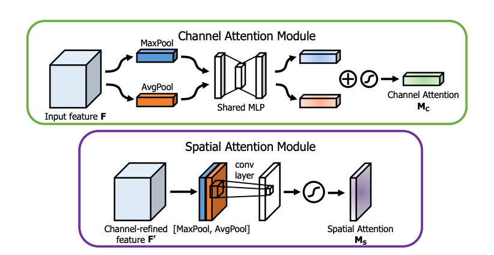

<h1>SamWeight: Optimizing Breast Cancer Detection with AUC Reshaping Techniques</h1>

**Contributors:** [Imade Bouftini](github.com/ibouftini) • [Ilyas Bounoua]() • [Sacha Bouchez-Delotte](mailto:Sacha.bouchez-delotte@hera-mi.com)

**Institutions:** [Ecole Centrale de Nantes](https://www.ec-nantes.fr/)   &   [Hera-Mi](https://www.hera-mi.com/)

---

<h3>📋 Table of Contents</h3>

  <a href="#-introduction">📖 Introduction</a> •
  <a href="#-objectives">🎯 Objectives</a> •
  <a href="#️-methods">⚙️ Methods</a> •
  <a href="#-results">📊 Results</a> •
  <a href="#-discussion">💬 Discussion</a> •
  <a href="#-references">🔗 References</a>

---

## Introduction

Breast cancer is a leading cause of mortality among women globally, emphasizing the critical role of early detection through mammography. In medical imaging, class imbalances and high misclassification costs (e.g., false negatives) pose significant challenges. Unfortunately, traditional performance metrics, such as the Area Under the Receiver Operating Characteristic (AU-ROC), fail to focus on critical regions of interest along the curve.

This project addresses these issues using a *Sample Weighting* technique to improve the sensitivity and specificity of deep learning models in detecting malignant regions in mammographic images [<a href="#ref-1">1</a>].

---

## Objectives

1. **Develop and implement** AUC Reshaping techniques to optimize model sensitivity at high-specificity thresholds
2. **Integrate AUC Reshaping** into a fine-tuned deep learning model to emphasize misclassified samples in critical ROC regions
3. **Evaluate the method** quantitatively and qualitatively

---

## ⚙️ Methods

### State-of-the-Art Sample Weighting Approaches

  
  
<em>Sample weighting classification strategies for imbalanced data</em>

**Key Differences:**
- **Static**: Fixed weights throughout training
- **Dynamic**: Weights change based on model performance

### Two-Stage Mammography Classification Approach

The standard methodology for mammography treatment involves:
1. **Bounding box detection** identifies suspicious areas
2. **Classification model** determines malignancy probability ← *AUC Reshaping applied here*

  
  
<em>Two-stage approach: Region detection followed by malignancy classification</em>

### Classification Model Architecture

Our model uses a state-of-the-art ResNet-22 [<a href="#ref-2">2</a>] with CBAM attention layers [<a href="#ref-3">3</a>]. Patches (small portions of a mammogram) containing masses and calcifications are used to train this model [<a href="#ref-4">4</a>].

  
  
<em>ResNet-22 with CBAM attention mechanism</em>

#### CBAM Attention Mechanism

The model incorporates **CBAM (Convolutional Block Attention Module)** to enhance feature representation:

- **Channel Attention**: Focuses on the **"what"** aspect of features by selectively emphasizing informative feature channels
- **Spatial Attention**: Focuses on the **"where"** aspect of features by identifying important regions in the feature maps

  
  
<em>Convolutional Block Attention Module [<a href="#ref-3">3</a>]</em>

### AUC Reshaping Theory

To enhance model's focus on critical regions, we employ an adaptive weighting mechanism informed by AUC Reshaping principles. This is mathematically formulated as follows:

Let $y_i \in \{0, 1\}$ denote the true label and $p_i$ the predicted probability for sample $i$. The reshaped loss function is:

$$\mathcal{L} = - \sum_{i=1}^N \left[ y_i \log(p_i - b_i) + (1 - y_i) \log(1 - p_i + b_i) \right]$$

where $b_i$ represents the boosting value, defined as:

$$b_i = \begin{cases}
n, & \text{if } y_i = 1 \text{ and } p_i < \theta_{\text{max}} \\
0, & \text{otherwise}
\end{cases}$$

**Parameters:**
- $\theta_{\text{max}}$: High-specificity threshold
- $n$: Boosting factor, modulating emphasis on misclassified positive samples

> **Key Insight**: The AUC Reshaping function selectively modifies the ROC curve within a *Region of Interest (ROI)*, typically at high-specificity thresholds (e.g., 0.95 or 0.98). By iteratively boosting sample weights, it reduces false negatives without significantly increasing false positives.

### Training Workflow

  
  
<em>AUC Reshaping training pipeline with batch-level threshold updates</em>

---

## Implementation & Experimental Setup

### Dataset Configuration

  
  
  
<em>Left: Training dataset distribution | Right: Validation dataset distribution</em>

#### Training Data
- **CBIS-DDSM**: 1,349 UIDs
- **Zola (In-house)**: 1,233 UIDs  
- **VinDr**: 1,042 UIDs
- **Total Patches**: 6,622

#### Validation Data
- **INbreast**: 107 UIDs
- **Total Patches**: 174

### Technical Implementation

#### Threshold Calculation Strategy

We systematically evaluated different threshold updating methods:

- **Static approach**: Single calculation before training
- **Epoch-level updates**: Recalculation at each epoch boundary
- **Batch-level updates**: Dynamic adjustment during training

> **Experimental Finding**: Batch-level threshold updates yielded superior performance.

#### Hardware Optimization

For effective AUC Reshaping, fine-tuning should be carried out over 1,000-2,000 epochs.

**RTX 2080 Ti GPU Optimization Techniques:**

| Optimization | Implementation | Benefit |
|--------------|----------------|---------|
| Mixed Precision Training | Working on `mixed_float16` | Up to 2-3x speedup via Tensor Cores |
| Memory Management | Using Keras sequence | Optimized VRAM utilization, reduced CPU-GPU bottleneck |
| Gradient Processing | Loss scaling with `LossScaleOptimizer` | Prevents underflow in FP16, maintains numerical stability |
| GPU Optimized Libraries | TensorFlow native operations, CuPy instead of NumPy | Enhanced performance |

> ** Impact**: Optimization reduced training time from 200s to 122s per epoch

---

## Results

### Performance Metrics Comparison

| Metric | Baseline Model | AUC Reshaped Model | Improvement |
|--------|----------------|-------------------|-------------|
| **AUC** | 0.92 | **0.937** | +1.8% |
| **Specificity@90% Sensitivity** | 70.3% | **81.2%** | **+10.9%** |
| **PRAUC** | 88.3% | **92.2%** | +4.4% |
| **F1-Score** | 78.1% | **84.1%** | +7.7% |

### Training Evolution

  
  
  
<em>Left: Loss evolution over epochs | Right: Metrics evolution over epochs</em>

- We notice the high variability of loss/metrics likely due to the high penalty values.
- The fixed metric (sensitivity) has some spikes due to the quantization of thresholds in ROC curve. The thresholds are chosen such that sensitivity is greater or equal to 90%.
  
### Final Model Performance

  
  
<em>ROC curve comparison: Baseline vs AUC Reshaped model</em>

---

## Discussion

### Key Contributions

✅ **Significant Performance Improvement**: Demonstrated +11% improvement in specificity at 90% sensitivity  
✅ **Practical Implementation**: Efficient GPU optimization with real-world applicability  
✅ **Robust Methodology**: Systematic evaluation of threshold updating strategies  

### Future Work

- Applying AUC Reshaping at higher sensitivity thresholds  
- Adding dynamic boosting factor adjustment
- Applying a regularization on threshold update (eg. moving average)
- Measuring clinical significance and real-world impact  

---

## References

[1] [Nature Research Article on Breast Cancer Detection](https://www.nature.com/articles/s41598-023-48482-x)

[2] [He, K., et al. (2015). "Deep Residual Learning for Image Recognition"](https://arxiv.org/abs/1512.03385)

[3] [Woo, S., et al. (2018). "CBAM: Convolutional Block Attention Module"](https://arxiv.org/abs/1807.06521)

[4] [William Lotter, Greg Sorensen, and David Cox. "A Multi-Scale CNN and Curriculum Learning Strategy for Mammogram Classification"](https://arxiv.org/abs/1707.06978)

---
